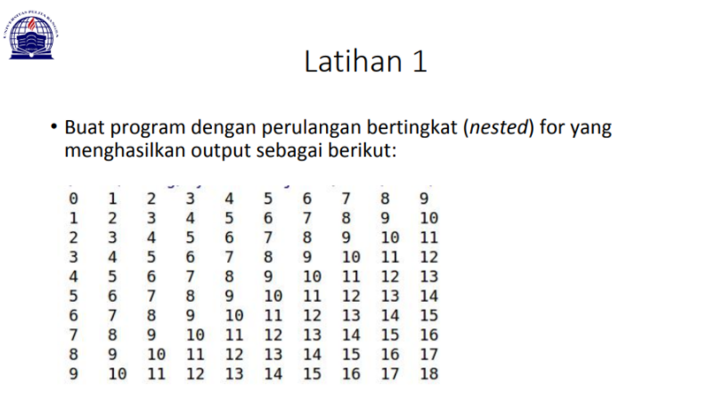

# LATIHAN 1
# PERTEMUAN 7
### NAMA: RAFI UBAIDILLAH
### KELAS: TI. 20. A. 1
### NIM: 312010090



Pada tugas pertama, saya diminta untuk membuat sebuah program pengulangan bertingkat yang nantinya akan menghasilkan output seperti gambat diatas. Untuk bisa dapat menghasilkan output tersebut maka saya memasukan syntax:

````
baris = 10
kolom = baris

for bar in range(baris):
    for col in range(kolom):
        tab = bar+col
        print("{0:>5}".format(tab), end='')
    print()
````

Mengapa demikian? Karena untuk dapat melakukan pengulangan bertingkat kamu perlu memasukan

````
Mengapa demikian? Karena untuk dapat melakukan pengulangan bertingkat kamu perlu memasukan
````


