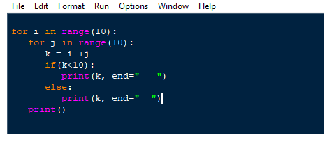

# LATIHAN 1


# JAWABAN

* Buka text editor, PyCharm, Atom, Visual Studio, dan lain-lain. Kemudian salin kode berikut

````
1 for i in range(10):
2     for j in range(10):
3         k = i + j
4         if(k<10):
5             print(k, end="   ")
6         else:
7             print(k, end="  ")
8     print()
9
````



